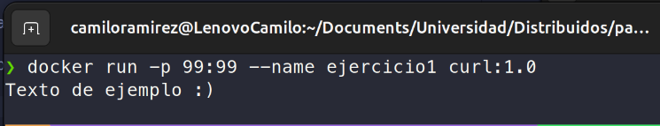

**Nombre: Camilo Esteban Ramirez Salas**

**Código: 202214307**

**Ejercicio 1.**
 
 Creación de la imagen personalizada y el archivo txt

 Compilación de la imagen

 Contenedor mostrando el texto copiado

**Ejercicio 2.**

 Creación del volumen y el contenedor con postgres-alpine

 Creación de la tabla e inserción de registros

 eliminación del contenedor, luego levantar un contenedor con el mismo volumen y verificar que los datos siguen existiendo.

**Ejercicio 3.**

 Creación del directorio y archivo html

 Levantamiento del contenedor y comprobación del contenido.

 Modificación del index.html y comprobación con curl

**Ejercicio 4.**

 Creación del contenedor interactivo, creación y listado de archivos existentes.

 Eliminación del contenedor, creación de un nuevo contenedor con la misma imagen y listado del contenido.
